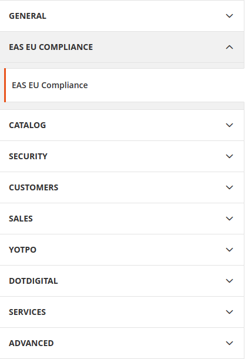

    

EAS integration module is available for both newest Magento versions 2.4.* and  2.3.5 version.

### You may install this module using composer or git

*Note

To install this module, your composer version must be 2 or higher.

In case your installation is not compatible with the latest composer version, you should use git to install it.

### **To install this module using composer**

Use composer require eas/eucompliance:dev-master (for latest version for magento 2.4.*) php 8.1

Or

`composer require eas/eucompliance:dev-feature/2.4.5  ( In case your magento version is magento 2.4.5)
`

You should get following result

    

### **To install this module using git**

Login in to your web server shell.
Be sure that PHP JWT (5.3) plugin installed.

Navigate to the root magento 2 installation directory

You can install PHP JWT using command

`composer require firebase/php-jwt:5.3
`

After that navigate to the magetno code directorу.

`cd app/code/
`
Create directory Easproject
`mkdir Easproject
`

And clone module

`git clone https://github.com//EAS-project-oy/eucompliance
`

After installation from root magento folder:
  to enable module run: `bin/magento se:up`
  to generate module classes run: `bin/magento s:s:d -f && bin/magento s:d:c`
  You can run it all in one command: `bin/magento se:up && bin/magento s:s:d -f && bin/magento s:d:c`
  If you are planning to use "Standard solution" mode, make sure to create the right magento crontab file with the command `bin/magento cron:install`

After doing so, `bin/magento mo:st Eas_Eucompliance` should return

    

Which means, module is successfully installed and enabled.

After installation, you need to configure the module.

To do so, navigate to Stores → Configuration section in admin. You should be able to see EAS EU Compliance tab

    

Expand it, and click the General tab.

After navigating, you will see 4 sections

_General_

Enable this solution  -  Enable/Disable module

Shipping methods by post - select shipping methods which use post mailing system.

*Note All non selected methods will be considered as delivering using courier.

_**Credentials**_ - get default urls from  https://dashboard.easproject.com/

**Standard Solution**  - This option used for stores with non compatible checkouts. To use EAS EU compliance with one page checkout plugins , please set YES. In that mode EAS EU compliance plugin will export paid orders to EAS solution. EAS EU compliance won't be injected into checkout process, that is why Taxes should be configured in the Magento store manually.
**EAS API Base URL**  -  base api url used for sending request

**EAS api key**  -  EAS credentials, which will be used during authorization (EAS should provide them after signing in contract)

**EAS secret api key** - EAS credentials, which will be used during authorization (EAS should provide them after signing in contract)

_**Attributes**_  - Those are product attributes, which will be used during calculation process.

**HSCODE** - Change if you already use another attribute to specify hscode.

**Reduced vat** -  Change if you already use another attribute to specify reduced vat.

**Warehouse country**  - Change if you already use another attribute for warehouse country.

_Advanced_

**Debug mode** - Enable/Disable debug mode, which will write data in debug log.

Those data contains data sent to api, data get from api, all errors.

#### Configuration EAS attributes on product level. For it, we should go to edit a product page in admin panel.

You can configure eas attributes, during product edition in EAS EU Compliance tab.

    

After the module is configured and enabled, you can test it.

During the checkout process, after shipping data is entered, and the shipping method is chosen, if you click on Next button, you should be redirected to EAS. Otherwise, you will see an error at the top of your screen.

    

    

### **Eas confirmation page**

If user accepts EAS additional costs, EAS will redirect customer to payment section.  Otherwise, it will redirect customer to cart section.

    

After Confirm we redirect the Customer to checkout payment with updated data. Where he can choose a payment method and then finish his order.

    

On Decline - we redirect the customer to cart section.

    

